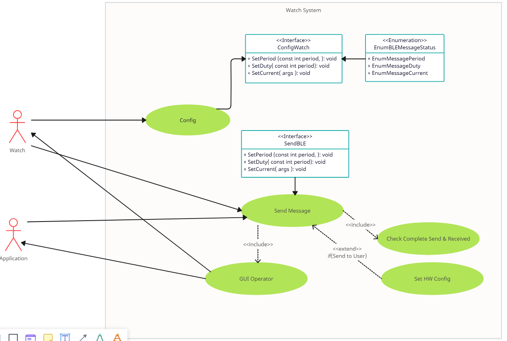

# STM32BLEDemo

# Tools

# HW Infomation
1. Nucleo-F103RB
   
3. HC-06

# Tools
1. Logic Analyzer
   
3. STM32cubeMX
   
5. IDE: stm32cubeide
   
7. C

# Usecase Diagram
Here is a UML diagram explaining the structure:

